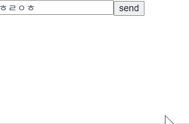

# react-fade

Proof of Concept react fade in/out that just works without any effort.

Inspired by react native layout animations.



## How it works

- FadeIn
  - nothing special,
  - Starts as `FadeIn` state and change it to `Normal` after 1 tick, So the browser will automatically make a transition for it.
- FadeOut:
  - Here's the trick. Prevents elements from being deleted on unmount and wait for fully(in this case, just waits 500ms) disappeared.
  - [Please see](https://github.com/pjc0247/react-fade/blob/master/src/component/FadeDiv.tsx#L80-L98)

```tsx
interface MessagesProps {
  messages: string[];
  onRemoveMessage: (x: string) => void;
}
const Messages = ({ messages, onRemoveMessage }: MessagesProps) => {
  return (
    <div>
      {messages.map((x) => (
        <MessageBubble key={x}>
          {x} <button onClick={() => onRemoveMessage(x)}>X</button>
        </MessageBubble>
      ))}
    </div>
  );
};

const MessageBubble = styled(FadeDiv)`
  opacity: 1;

  &.fadeIn {
    opacity: 0;
  }
  &.fadeOut {
    opacity: 0;
  }
`;
```
